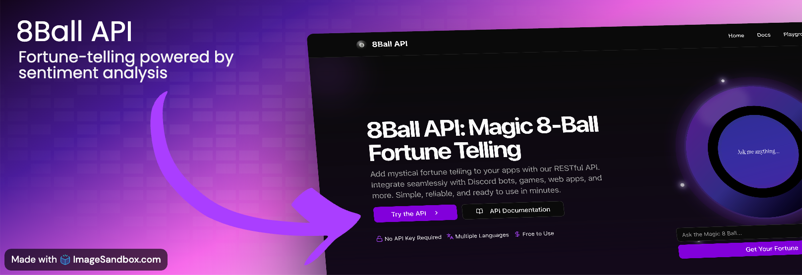

A modern Magic 8-Ball API built with Next.js that provides fortune-telling
responses to questions. The API offers various endpoints for random, biased, and
sentiment-based responses.

## Features

- Random fortune responses (classic 8-ball experience)
- Sentiment analysis of questions
- Biased responses based on question sentiment
- "Lucky" mode to influence response bias
- Multi-language support
- Edge runtime for optimal performance

## Getting Started

1. Clone the repository:

```bash
git clone https://github.com/jacobschwantes/eight-ball-api.git
cd eight-ball-api
```

2. Install dependencies:

```bash
npm install
```

3. Run the development server:

```bash
npm run dev
```

4. Open [http://localhost:3000](http://localhost:3000) to see the application

## Technology Stack

- [Next.js](https://nextjs.org/) - React framework with API routes
- [Sentiment](https://www.npmjs.com/package/sentiment) - Sentiment analysis
  library
- [Zod](https://zod.dev/) - TypeScript-first schema validation
- [Tailwind CSS](https://tailwindcss.com/) - Utility-first CSS framework
- TypeScript - Type safety and developer experience

## License

This project is open source and available under the MIT license.
